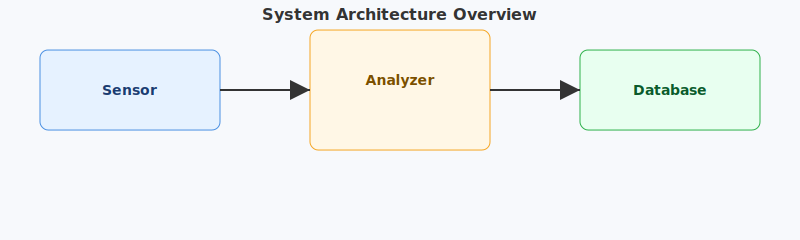
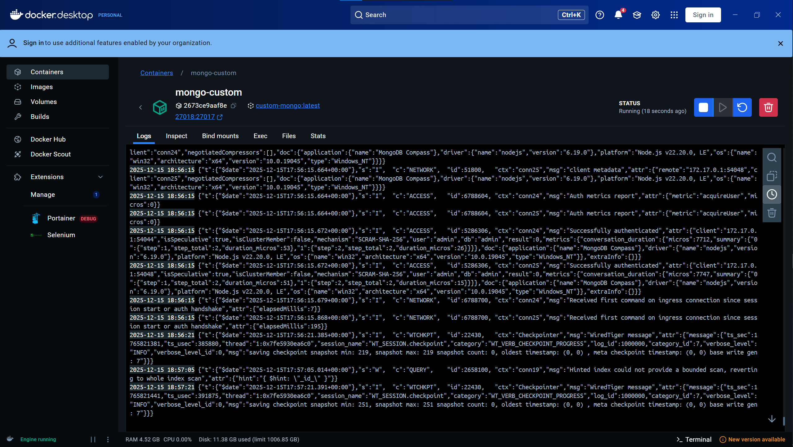
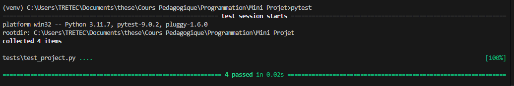
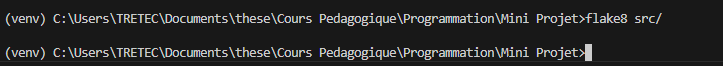
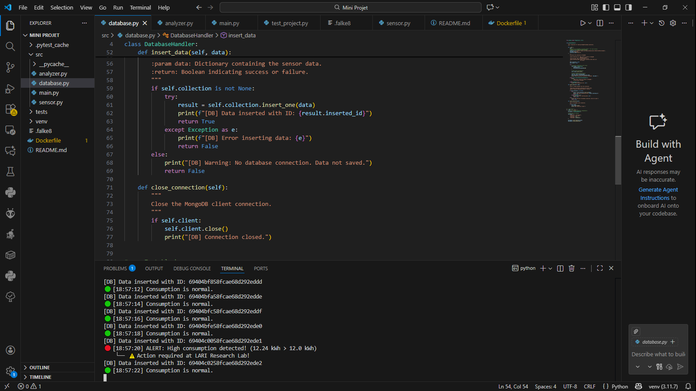
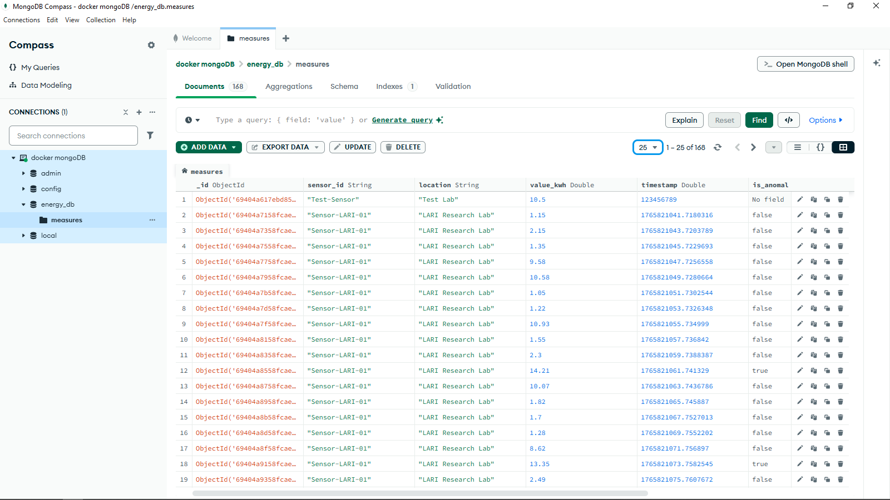
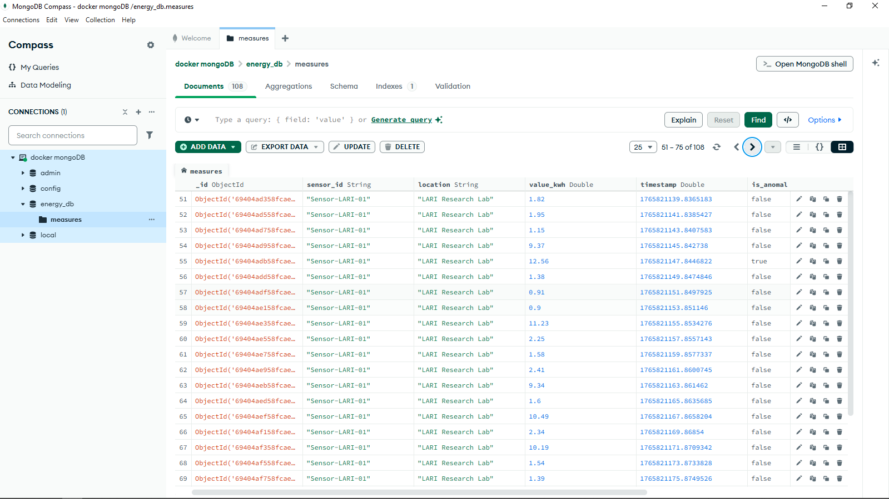

# ⚡ Mini Project: Energy Monitoring System (IoT)

## 📖 Introduction
This project was realized as part of the **Programming and Data Management** module. It aims to simulate a complete **IoT (Internet of Things)** architecture for the **LARI Research Laboratory**.

The main objective is to implement a system capable of monitoring electricity consumption in real-time. The system consists of a modular Python script that generates sensor data, analyzes this data to detect overconsumption anomalies (threshold > 12.0 kWh), and persistently stores the history in a database.



> **Note: This project supports two database configurations:**
> 1.  **Docker Version (Recommended):** Uses a containerized MongoDB on port `27018` to avoid local conflicts.
> 2.  **Default MongoDB Version:** Uses a standard local MongoDB installation on the default port `27017`.

## 📂 Project Structure
The project is organized as follows:

```text
MINI PROJET/
├── src/                         # Application source code
│   ├── Using_Docker_MongoDB2/   # Docker-specific version
│   │   ├── database.py      
│   │   ├── analyzer.py      
│   │   ├── sensor.py        
│   │   └── main.py          
│   ├── database.py              # Default version database management
│   ├── analyzer.py              # Anomaly detection logic
│   ├── sensor.py                # Sensor data simulation
│   └── main.py                  # Script entry point
├── tests/                       # Unit tests folder
├── captures/                    # Execution proofs/screenshots
│   ├── docker.jpg
│   ├── execution.png
│   ├── MongoDB1.png
│   └── MongoDB2.png
├── venv/                        # Python virtual environment
├── .gitignore                   # Files to be ignored by Git
├── Dockerfile                   # Docker image configuration
├── README.md                    # Project documentation
└── requirements.txt             # Project dependencies

```

## 🚀 Prerequisites* **Python 3.x**
* **Docker Desktop** (Required for the Docker version)
* **MongoDB Compass** (For data visualization)

---

## 🛠️ 1. Database Configuration 
### Option A : Docker Version (Port 27018)
We use Docker to isolate the database. The container maps the internal port 27017 to **27018** on your host.

1. **Build the Image:**
```bash
docker build -t energy-mongo .

```


2. **Run the Container:**
```bash
docker run -d -p 27018:27017 --name energy-db-container energy-mongo

```




*Figure 1: Docker Desktop showing the container active on port 27018.*

### Option B: Default MongoDB Version (Port 27017)
If you have MongoDB installed locally, ensure the service is running. The application will connect via the default port `27017` without requiring Docker.

---

## 🐍 2. Python Application Configuration
### A. Virtual Environment
```bash
# Windows
venv\Scripts\activate
# macOS/Linux
source venv/bin/activate

```

### B. Install Dependencies
```bash
pip install -r requirements.txt

```

---

## ✅ 3. Testing and Quality Control
### A. Unit TestingWe use `unittest` or `pytest` to ensure the logic works correctly. 
To run the tests, execute:

```bash
python -m unittest discover tests

```

### B. Code Linting (Flake8)To ensure the code follows **PEP 8** standards, we use **Flake8**. Run the following command:

```bash
flake8 src/

```


---

## ▶️ 4. ExecutionRun the main script to start the simulation:

```bash
python src/main.py

```



*Figure 2: VS Code terminal showing real-time logs and anomaly alerts.*

---

## 📊 5. Results Validation (MongoDB Compass)###Connection Settings (Docker Version)* **Host:** `localhost`
* **Port:** `27018`
* **Authentication:** `admin` / `securepassword`



*Figure 3: Data inserted into the measures collection.*



*Figure 4: Historical view of anomalies in the database.*


## ✅ 7. Tests et Qualité du Code

Pour garantir la fiabilité et la qualité du code, ce projet utilise des tests unitaires et un linter.

### A. Exécution des Tests Unitaires
Les tests sont situés dans le dossier `tests/`. Pour lancer l'ensemble des tests (vérification de la logique d'analyse, etc.), exécutez la commande suivante à la racine du projet :

```bash
pytest

```

### B. Vérification du Code (Flake8)

Nous utilisons **Flake8** pour nous assurer que le code respecte les standards PEP 8 (style, syntaxe, imports inutilisés).

Pour lancer l'analyse sur le code source :

```bash
flake8 src/

```

